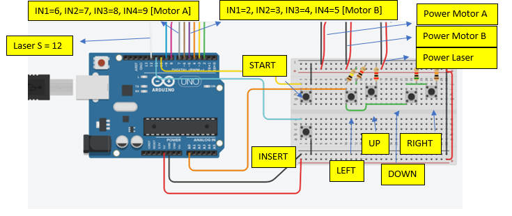

## Laser Projector with Arduino 

In this project a simple laser projector was developed using an Arduino uno. The projector works in 3 different modes, automatic mode, user-defined path mode and pattern selection mode. The goal of the project was to exploit a digital logic framework in order to make the projector work by at least showing some geometric patterns or draw simple user-defined vector graphics. 

### Components 
List of Components
- Arduino uno
- 2 stepper motors (28BYJ-48)
-	Laser diode (650 nm, 5V)
-	2 H-bridge modules (L298N, ULN2003)
-	Protoboard or pcb protoboard, etc. 
-	Cables
-	6 push buttons
-	5 resistances (100kΩ, 10kΩ, 5kΩ, 2kΩ, 1kΩ) 
-	2 mirrors (approx. 1cm^2 each)
-	USB cable (type B) or adapter for Arduino 

### Circuit Schematic



### System Operation

Our system can be described in four parts, the microcontroller, the drivers, the motors and the button-laser devices. And the operation is mainly managed by selecting different modes of the laser projector. 

**Microcontroller**

The microcontroller is an Arduino uno based model. For our system we used 11 digital pins, 2 power pins and 1 analog pin. 

**Digital pins**

The digital pins in our system mainly for control purposes, that means we used them as outputs for the motors, laser signal and buttons digital inputs. The assignations for the pins are the following:
-	Pins 2, 3, 4, 5 are assigned to the Inputs 1, 2, 3, 4 of Motor B (horizontal motor)
-	Pins 6, 7, 8, 9 are assigned to the Inputs 1, 2 ,3, 4 of Motor A (vertical motor)
-	Pins 10, 11 are assigned for the start and insert button respectively
-	Pin 12 is assigned as the digital enabler of the laser diode

**Analog pin**

The system uses one analog pin for reading different values of a voltage divisor that is composed by 4 push up buttons, which represent the left, up, down, right functions in the diverse modes of the laser projector. 

**Drivers**

In order to move the mirrors where the laser is projected we used two stepper motors, these motors need an intermediate power stage in order to be connected to the Arduino uno, that’s because the necessary current for the motors to work is not provided by the output pins of the Arduino. One of the simplest power stages used for simple motors is the well known [H-bridge](https://en.wikipedia.org/wiki/H-bridge). In our case, in order to simplify our work we used two drivers (dual H-bridges) that act as power stages for our motors, the models used are a driver with L298 dual bridge and a driver ULN2003 (Darlington array), but if possible using two ULN2003 drivers is enough. 

**Motors**

The motors used are two unipolar two-phased stepper motors 28BTY-48, this choice was made due to the precision of a stepper motor and their low cost. Its mechanical characteristics can be seen in its [datasheet](https://www.digikey.com.mx/en/datasheets/mikroelektronika-step-motor-5v-28byj48-datasheet?utm_adgroup=General&utm_source=google&utm_medium=cpc&utm_campaign=Dynamic%20Search_EN&utm_term=&productid=&gclid=CjwKCAjwgdX4BRB_EiwAg8O8HXDM4YIjN022YfVtW3WWGJbgL8Et_MBya29vUJ-F9t0HuDvP6Ig1zRoC2mEQAvD_BwE).

**Operation**

The laser projector operation can be divided in different stages:
-	Start and mode selection
-	Mode 1 – Automatic
-	Mode 2 – User defined path
-	Mode 3 – Pattern selection 

**Start and mode selection**

To start the system the start button must be pressed, if the system has started the laser diode will be ON. After starting the laser projector, the Arduino will enter in mode selection meaning that the user must define the mode to use by pressing the up or down button, the mode selection stage starts with the Mode 1 then to start this mode the user must press the up button an then press the insert button, if the insert button is not press after the up or down button the system will remain in the mode selection stage, also the system moves modes in the sequence 1-2-3 or 3-2-1 only. 

**Mode 1 – Automatic**

The first mode is the automatic mode, for automatic we mean that the laser projector will use a pre-defined pattern already programmed in the Arduino and execute it. After the automatic mode is finished, the system will return to the mode selection stage. 

**Mode 2 – User defined path**

The second mode is the user defined path, for this mode the user will be able to save a pattern that the laser will follow once it is defined. To define the path the user must push the movement buttons (up, down, right, left) once at a time, the available movements are constrained into a squared 9 point grid and every sequence of buttons pressed must end at the same point where it started, the available number of buttons pressed is 20. After ending a sequence the user must press the insert button in order for the laser projector to draw the pattern. After the pattern is drawn the system will return to the mode selection stage. 

**Mode 3 – Pattern selection** 

The third mode is pattern selection, in this mode the laser projector will draw different pre-configured patterns and the user will be able to see them and select a sequence of them. To move between patterns the left and right buttons can be used and to save a pattern in the sequence the up button must be used, after the final sequence is defined the user must press the insert button, also if the user want to exit this mode the down button must be pressed. After the sequence is defined and drawn by the laser projector the system will return to the mode selection stage. 

### Code Brief Description

**Setup**

This is the initial part of the code where the definitions of the variables used is made and the Arduino pins are defined. In the setup functions the input and output variables are assigned. In particular, the library Stepper.h is used to simplify the manipulations of the stepper motors. 
<details>
  <summary>Code</summary>
  
```cpp
#include<Stepper.h>

//Start up variables
int buttonval = 0;                  //analog input buttons
int laserpin = 12;                  //pin laser
int revstep = 15;                   //Range of steps per cycle (1.32°)
int stepcount = 0;                  //number of steps in diagonal function
int st = 1;                         //Min. step. (0.1°);
const int stepsRev =512;            //Max. number of steps per cycle
Stepper motorA(stepsRev, 6,7,8,9);  // Motor A setup
Stepper motorB(stepsRev, 2,4,3,5);  // Motor B setup

//UI
int startpin = 10;                  //pin of start button
int startbutton = 0;                //Read input from start pin
int state = 0;                      //state of the system on/off

//Mode selection
int selectval = 0;                  //value given due to the analog input for mode selection (up or down)
int insertMode = 0;                 //insert button to define the mode selected
int pushcountM = 0;                 //counter of the number of times the button up or down is selected
int selectcount = 0;                //counter for the number of times the insert button is pressed
int actmode = 0;                    //actual mode of the system
int modes [3] = {0,1,2};            //number of modes that the system have (0-automatic,1-user-defined path,2-pattern selection)

// Path Definition variables
int insertpin = 11;                 //pin definition of the insert button
int insert = 0;                     //value of pin insertpin
int numseq= 20;                     //max. number of points selection on a 9 point grid
int pushcount = 0;                  //counter for the number of times the pathselection buttons had been pressed
int seq [20];                       //array containing the sequence defined by the user
int countvert = 0;                  // counter for the vertical steps taken
int counthorz = 0;                  // counter for the horizontal steps taken

// Pattern selection variables
int numpat = 3;                     //number of patterns available
int insertpat = 0;                  //insert pattern variable
int patselectval = 0;               //pattern selection variable
int pushcountpat = 0;               //counter for how many times the pattern buttons are pressed
int pattern [3];                    //indexes for pattern selection
int letter = 1;                     //type of letter selected

void setup() {
  pinMode(laserpin,OUTPUT);         //Laser pin enable
  pinMode(startpin,INPUT_PULLUP);   //start Button pin enable
  pinMode(insertpin,INPUT_PULLUP);  //insert button pin enable
  motorA.setSpeed(45);              //vertical direction - speed (rpm)
  motorB.setSpeed(45);              //horizontal direction
  Serial.begin(9600);               
}
```
</details>

**Loop**

In this function the Arduino executes the modes selected by the user. In the first part the Arduino waits for the start button to change its state to 1 (button pressed), after that enters the Mode selection function, in the mode selection function the actual mode is defined so the Arduino starts the sequence corresponding to the mode selected. After the Arduino finishes the execution of the mode selected the start button can be pressed to turn off the system or wait and select another mode. 
<details>
  <summary>Code</summary>
  
```cpp
void loop() {
  // Turn on reading
  startbutton = digitalRead(startpin); 
  onoffButton(); 
  delay(100);
  if (state == 1){
    // current state reading
    while (startbutton = digitalRead(startpin)==HIGH){
      digitalWrite(laserpin,HIGH);
      Mode(); // Mode selection
      if (modes[actmode] == 0){
        Serial.println("Mode 1");
        polimi();
        selectcount = 0;
      } else if (modes[actmode]==1){
        Serial.println("Mode 2");
        pathdef();
        Routine();
        selectcount = 0;
      } else if (modes[actmode]==2){
        Serial.println("Mode 3");
        patternselect();
        for (int i=0;i<numpat;i++){
          alphabet(pattern[i]);
          delay(500);
        }
        selectcount = 0;
      }
      
    }
    onoffButton();// Turn off reading
  } else{
    digitalWrite(laserpin,LOW); //Turn off laser
  }
}
```
</details>

**Mode function**
 
In this function there are 3 inputs, these inputs are the insert button, up, down buttons and the output will be the actual mode selected (actmode). At the beginning the function enter a cycle that is conditioned on the insert button state, that means if a mode has been inserted by pressing this button then the cycle will end and the actual mode is updated. 
If the insert button is not pressed then we enter to another cycle that is the mode selection process, this selection process has an actual mode state (actmode) this state can have three values 0, 1, 2 that are in correspondence with the array elements of the variable modes which describes the modes of the Laser projector. So to change between modes we use an analog input that is composed by an array of 4 buttons, by reading the values of the analog input when the buttons are pressed we can discretize the range in four indicating, for this function we will use only the up and down button. The up button defines a “past” state therefore the last mode used so if pressed the system will select the last mode, also a condition is made in this process in order to constraint further movements beyond the zero mode (we will not have negative modes). The down button is similar with the difference that it defines the “next” state or mode. After each mode movement the insert button must be pressed in order to define that mode as the actual mode and exit the cycle. 
<details>
  <summary>Code</summary>
  
```cpp
void Mode(){
    while(selectcount == 0){
      delay(3000);
      insertMode = digitalRead(insertpin);
      Serial.println(insertMode);
      if(insertMode == 1){
        pushcountM =0;
        while (pushcountM==0){
             selectval = analogRead(A0);
             Serial.println(selectval);
             if (selectval>=970 && selectval<=980){
                if (actmode != 0){
                  actmode = actmode - 1;
                }else {
                  actmode = actmode;
                }
                Serial.println("Past mode");
                pushcountM = pushcountM + 1;
             }else if (selectval>=955 && selectval<=965){
                if (actmode != 3){
                  actmode = actmode + 1;
                }else {
                  actmode = actmode;
                }
                Serial.println("Next mode");
                pushcountM = pushcountM + 1;
             }
          }
      } else {
          selectcount = selectcount + 1;
          pushcountM = 0;
      }
      
    }
}
```
</details>

**Path definition function**

This function is selected in the mode 2 of the laser projector. It has 5 inputs, insert button, up, down, left and right buttons, and the output will be a sequence of instructions to give to the stepper motors in order to draw a path. In order to save the sequence a cycle for is used where every iteration an instruction will be saved, then at the end of the for cycle a sequence (seq[]) will be defined. Another functionality is that a sequence can be defined through the insert button, this can be done after defining an instruction and then pressing insert. 
The available paths to define a sequence are in the directions up, down, right and left, and are constrained in a 9 point grid with the condition that the starting instruction will be the end instruction, this constrain is defined due to the mechanical limitations of the laser projector (minimum range of movement of the motor in a fast frequency, and size of the mirrors used) and to the starting point of the step motors. 
<details>
  <summary>Code</summary>
  
```cpp
void pathdef(){
  for (int i=0;i<numseq;i++){
      delay(3000);
      insert = digitalRead(insertpin);
      if(insert == 1){
        while (pushcount==0){
             buttonval = analogRead(A0);
             Serial.println(buttonval);
             if (buttonval>=981 && buttonval<=1010){  
                seq [i] = 1;
                Serial.println(1);
                pushcount = pushcount + 1;
             }else if (buttonval>=970 && buttonval<=980){
                seq [i] = 2;
                Serial.println(2);
                pushcount = pushcount + 1;
             }else if (buttonval>=950 && buttonval<=963){
                seq [i] = 3;
                Serial.println(3);
                pushcount = pushcount + 1;
             }else if (buttonval>=915 && buttonval<=928){
                seq [i] = 4;
                Serial.println(4);
                pushcount = pushcount + 1;
             }
          }
      } else {
        i = numseq;    
      }
    pushcount = 0;
  }
  for(int i=0;i<numseq;i++){
    Serial.println(seq[i]);
  }
}
```
</details>

**Routine function**

This function executes the sequence defined on pathdef(). It is done by assigning the stepper motors the number of steps to make, in our case the minimum step with visible results is defined by the variable revstep. Also to achieve this in a more simplified way we used the stepper library that includes a defined method for defining the steps of a [stepper motor](https://en.wikipedia.org/wiki/Stepper_motor). In our case we use a configuration for our stepper motors in a “wave drive” (activating one coil of the motor at a time) mode in order to have more speed. Also we define two variables, counthorz and countvert to know how many instructions on the 9 point grid are taken (this is only for scope purposes).
<details>
  <summary>Code</summary>
  
```cpp
void Routine(){
  for (int i = 0; i<=numseq-1;i++){
    if (seq[i]==1){
      motorB.step(revstep);
      counthorz = counthorz + revstep;
    }else if (seq[i]==4){
      motorB.step(-revstep);
      counthorz = counthorz - revstep;
    }else if (seq[i]==2){
      motorA.step(-revstep);
      countvert = countvert - revstep;
    }else if (seq[i]==3){
      motorA.step(revstep);
      countvert = countvert + revstep;
    } else {
      i = numseq;
    }
    seq[i]=0;
    delay(5);
  }
}
```
</details>

**Pattern selection function**

This function executes the mode 3 of the laser projector. This function have as inputs the insert button and the up, down, left and right buttons and have as output a sequence of 3 selected patterns. 
It is done by first entering a for cycle in order to have a control over the predefined patterns order,  and with the pattern array initiated in zeros and also the letter variable (this variable selects the pattern since for this project the predefined patterns are letters it is called letter). Since the variables are initiated at zero we enter the while cycle, in the while cycle we call another function alphabet(letter) that will project the patterns already predefined in the laser projector. Then to change between patterns the variable patselectval will read the input of the buttons up, down, left, right, the left and right button will change between patterns and the variable down will exit this mode, for saving the pattern the button up must be pressed and then for the final sequence the button insert must be pressed, this way the projector will draw the sequence of patterns saved. 
<details>
  <summary>Code</summary>
  
```cpp
void patternselect(){
  for (int i=0;i<numpat;i++){
      delay(3000);
      insertpat = digitalRead(insertpin);
      if(insertpat == 1){
        while (pushcountpat==0){
          alphabet(letter);
          patselectval = analogRead(A0);
          Serial.println(patselectval);
          if (patselectval>=996 && patselectval<=1010){  
            if (letter != 1){
              letter = letter - 1;
            } else {
              letter = letter;
            }
            Serial.println("left");
          }else if (patselectval>=920 && patselectval<=930){
            if (letter != 3){
              letter = letter + 1;
            } else {
              letter = letter;
            }
            Serial.println("right");
          }else if (patselectval>=980 && patselectval<=990){
            pattern [i] = letter;
            Serial.println("selected");
            pushcountpat = pushcountpat + 1;
          }else if (patselectval>=965 && patselectval<=975){
            Serial.println("exit");
            pushcountpat = pushcountpat + 1;
            i = numpat;
          }
        }
      } else {
        i = numpat;    
      }
    pushcountpat = 0;
  }
}
```
</details>

**Alphabet function**

This function is the function used to select preconfigured patterns, in our case we use letters, these functions (letterA(), etc) are sequence of instructions for the stepper motors. This function has as input the variable letter whose vale is defined inside the function patternselect().
<details>
  <summary>Code</summary>
  
```cpp
void alphabet(int letter){
  switch (letter){
    case 1:
      for (int i=0;i<20;i++){
        letterA();
      }
      break;
    case 2:
      for (int i=0;i<20;i++){
        letterB();
      }
      break;
    case 3:
      for (int i=0;i<20;i++){
        letterC();
      }
      break;
    default:
      break;
  }
}
```
</details>

**OnOff function**

This function is used to define the state of the start button after being pressed. 
<details>
  <summary>Code</summary>
  
```cpp
void onoffButton(){
  if (startbutton == HIGH && state == 0){
    //stay OFF 
    state = 1-startbutton;
  }else if (startbutton == HIGH && state ==1){
    //stay ON
    state = 1;
  }else if (startbutton == LOW && state == 0){
    //ON
    state = 1;
  }else{
    //OFF
    state = startbutton;
  }
}
```
</details>
